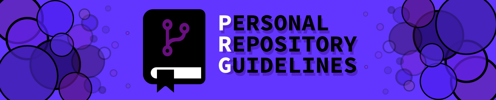
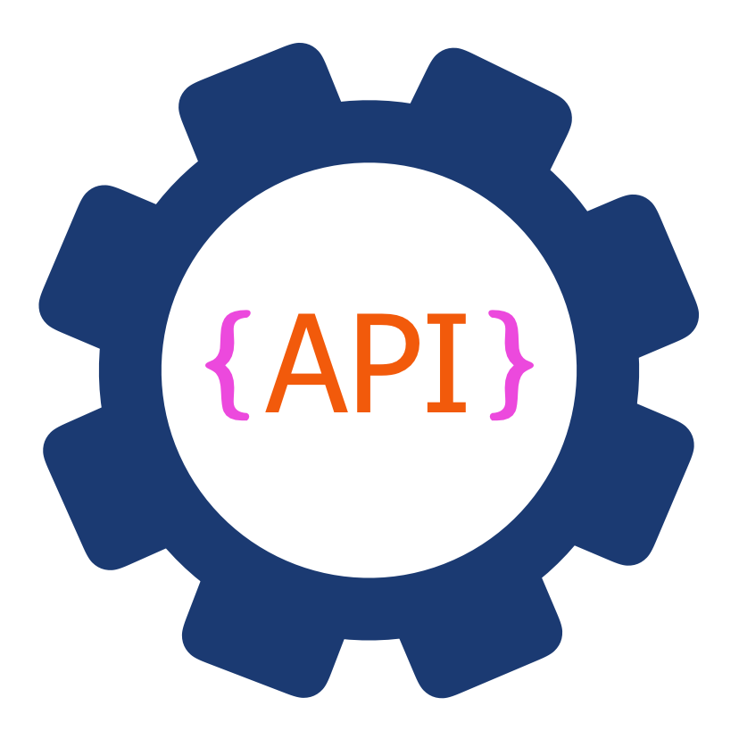

<!-- Begin README -->

[](https://scottgriv.github.io/PRG-Personal-Repository-Guidelines/)

<p align="center">
    <a href="https://github.github.com/gfm/" target="_blank"></a>
    <a href="https://jekyllrb.com/" target="_blank"></a>
    <a href="https://datatables.net/" target="_blank"></a>
    <a href="https://www.python.org/" target="_blank"></a>
    <br>
    <a href="https://docs.github.com/en/rest?apiVersion=2022-11-28 "></a>
    <a href="https://github.com/scottgriv/PRG-Personal-Repository-Guidelines/actions/workflows/main.yml" target="_blank"></a>
    <a href="https://github.com/scottgriv/PRG-Personal-Repository-Guidelines/actions/workflows/pages/pages-build-deployment" target="_blank"></a>
    <br>
    <a href="https://github.com/scottgriv"></a>
    <a href="mailto:scott.grivner@gmail.com"></a>
    <a href="https://www.buymeacoffee.com/scottgriv"></a>
    <br>
    <a href="https://github.com/scottgriv/PRG-Personal-Repository-Guidelines/releases" target="_blank"></a>
    <a href="https://prgoptimized.netlify.app" target="_blank">
    </a>
    <a href="https://prgportfolio.com" target="_blank"></a>
</p>

---

<h1 align="center">📃 Personal Repository Guidelines (PRG)</h1>

**PRG** is a repository categorization and guideline framework. By harnessing the power of GitHub Actions, it automatically crafts a tier-based display, neatly categorizing your repositories for enhanced clarity and impact. Beyond mere organization, it sets forth comprehensive guidelines, templates for `READMEs`, and overall repository structure, ensuring each project is showcased with maximum professionalism and coherence.

- Categorized your repositories and projects into  **Platinum**,  **Gold**,  **Silver**, and  **Bronze** tiers for your **GitHub Portfolio**.
  - Display your repositories in a searchable and sortable `HTML` table, created with GitHub Actions and displayed through GitHub Pages, to organize and showcase your projects to the world.
    - You can send specific projects via a predefined search URL parameter by appending `/?search=` to your `PRG` URL and add whatever project name, language, tech, category, etc.
- Follow the defined guidelines to guide your repository structure and `README` content.
- Utilize the predefined `README` templates to get your projects up and running quickly and easily so you can focus on what matters most - your code!

<div align="center">
  <a href="https://prgportfolio.com" target="_blank">
    
  </a>
  <br>
  <i><b>PRG</b> creates a HTML table to showcase your projects in your <b>GitHub Portfolio</b>.</i>
</div>

---

## Table of Contents

- [PRG Document Library](#prg-document-library)
- [Features](#features)
- [Background Story](#background-story)
  - [README Driven Development (RDD)](#readme-driven-development-rdd)
  - ["The GitHub Portfolio Problem"](#the-github-portfolio-problem)
  - [Telling a Story with your README](#telling-a-story-with-your-readme)
- [Definitions](#definitions)
- [Q&A](#qa)
- [Getting Started](#getting-started)
- [What's Inside?](#whats-inside)
- [1. Categories](#1-categories)
  - [PRG Connection File](#prg-connection-file)
  - [Tier Badges](#tier-badges)
    - [ Platinum Tier Project Badge](#platinum-tier-project-badge)
    - [ Gold Tier Project Badge](#gold-tier-project-badge)
    - [ Silver Tier Project Badge](#silver-tier-project-badge)
    - [ Bronze Tier Project Badge](#bronze-tier-project-badge)
    - [ Optimized Tier Project Badge](#optimized-tier-project-badge)
  - [Profile Badges](#profile-badges)
    - [ PRG Collection Badge](#prg-collection-badge)
  - [Building the Project Tier Table](#building-the-project-tier-table)
- [2. Guidelines](#2-guidelines)
  - [Category Guidelines](#category-guidelines)
  - [Brand Guidelines](#brand-guidelines)
  - [README Guidelines](#readme-guidelines)
  - [Repository Settings Guidelines](#repository-settings-guidelines)
  - [Repository Structure Guidelines](#repository-structure-guidelines)
- [3. Templates](#3-templates)
  - [Project Templates](#project-templates)
    - [ Platinum Tier Template](https://github.com/scottgriv/PRG-Platinum-Tier-Template)
    - [ Gold Tier Template](https://github.com/scottgriv/PRG-Gold-Tier-Template)
    - [ Silver Tier Template](https://github.com/scottgriv/PRG-Silver-Tier-Template)
    - [ Bronze Tier Template](https://github.com/scottgriv/PRG-Bronze-Tier-Template)
  - [License Templates](#license-templates)
- [Closing](#closing)
  - [PRG Showcase](#prg-showcase)
- [What's Next?](#whats-next)
- [Project](#project)
- [Contributing](#contributing)
- [Resources](#resources)
  - [General Resources](#general-resources)
  - [GitHub Portfolio Related Resources](#github-portfolio-related-resources)
  - [UML Diagram](#uml-diagram)
  - [Handy Web Tools](#handy-web-tools)
- [License](#license)
- [Credits](#credits)

## PRG Document Library

Below is a list of all the documents and resources available for **PRG**.

<table>
<!-- Row 1 -->
  <tr>
    <td align="center">
      <div style="margin: 10px; text-align: center;">
        <a href="./guidelines/category_guidelines.md">
          
          <br>
          <b>Category Guidelines</b>
        </a>
        <p>Guidelines for categorizing your repository tiers and naming conventions.</p>
      </div>
    </td>
    <td align="center">
      <div style="margin: 10px; text-align: center;">
        <a href="./guidelines/brand_guidelines.md">
          
          <br>
          <b>Brand Guidelines</b>
        </a>
        <p>Guidelines for creating your own brand for your project.</p>
      </div>
    </td>
    <td align="center">
      <div style="margin: 10px; text-align: center;">
        <a href="./guidelines/readme_guidelines.md">
          
          <br>
          <b>README Guidelines</b>
        </a>
        <p>Guidelines for repository READMEs.</p>
      </div>
    </td>
  </tr>
<!-- Row 2 -->
  <tr>
    <td align="center">
      <div style="margin: 10px; text-align: center;">
        <a href="./guidelines/repository_structure_guidelines.md">
          
          <br>
          <b>Repository Structure Guidelines</b>
        </a>
        <p>Guidelines for repository structure and files.</p>
      </div>
    </td>
    <td align="center">
      <div style="margin: 10px; text-align: center;">
        <a href="./guidelines/repository_settings_guidelines.md">
          
          <br>
          <b>Repository Settings Guidelines</b>
        </a>
        <p>Guidelines for repository settings.</p>
      </div>
    </td>
    <td align="center">
      <div style="margin: 10px; text-align: center;">
        <a href="https://prgportfolio.com">
          
          <br>
          <b>PRG Portfolio Website</b>
        </a>
        <p>An example PRG Portfolio from PRG's creator.</p>
      </div>
    </td>
  </tr>
<!-- Row 3 -->
  <tr>
    <td align="center">
      <div style="margin: 10px; text-align: center;">
        <a href="./categories/table_generator_guide.md">
          
          <br>
          <b>Table Generator Guide</b>
        </a>
        <p>Guide for setting up the Python (PyRG) project tier table generator script.</p>
      </div>
    </td>
      <td align="center">
      <div style="margin: 10px; text-align: center;">
        <a href="./categories/badge_reference_guide.md">
          
          <br>
          <b>Badge Reference Guide</b>
        </a>
        <p>Guide for displaying the tier badges.</p>
      </div>
    </td>
    <td align="center">
      <div style="margin: 10px; text-align: center;">
        <a href="./templates/template_guide.md">
          
          <br>
          <b>Template Guide</b>
        </a>
        <p>Guide for using the provided templates.</p>
      </div>
    </td>
  </tr>
<!-- Row 4 -->
  <tr>
    <td align="center">
      <div style="margin: 10px; text-align: center;">
        <a href="https://github.com/scottgriv/PRG-Platinum-Tier-Template">
          
          <br>
          <b>Platinum Tier Template</b>
        </a>
        <p>Platinum project template for your repositories.</p>
      </div>
    </td>
    <td align="center">
      <div style="margin: 10px; text-align: center;">
        <a href="https://github.com/scottgriv/PRG-Gold-Tier-Template">
          
          <br>
          <b>Gold Tier Template</b>
        </a>
        <p>Gold project template for your repositories.</p>
      </div>
    </td>
    <td align="center">
      <div style="margin: 10px; text-align: center;">
        <a href="https://github.com/scottgriv/PRG-Silver-Tier-Template">
          
          <br>
          <b>Silver Tier Template</b>
        </a>
        <p>Silver project template for your repositories.</p>
      </div>
    </td>
  </tr>
<!-- Row 5 -->
  <tr>
    <td align="center">
      <div style="margin: 10px; text-align: center;">
        <a href="https://github.com/scottgriv/PRG-Bronze-Tier-Template">
          
          <br>
          <b>Bronze Tier Template</b>
        </a>
        <p>Bronze project template for your repositories.</p>
      </div>
    </td>
    <td align="center">
      <div style="margin: 10px; text-align: center;">
        <a href="PRG.md">
          
          <br>
          <b>PRG Connection File</b>
        </a>
        <p>Connection File (PRGCF) for your repositories.</p>
      </div>
    </td>
    <td align="center">
      <div style="margin: 10px; text-align: center;">
        <a href="./scripts/project_tier_table_generator.py">
          
          <br>
          <b>Table Generator Script</b>
        </a>
        <p>Python script for generating the project tier table (PyRG).</p>
      </div>
    </td>
  </tr> 
<!-- Row 6 -->
  <tr>
  <td align="center">
      <div style="margin: 10px; text-align: center;">
        <a href="./categories/project_tier_table.md">
          
          <br>
          <b>Project Tier Table</b>
        </a>
        <p>Project tier table for your projects.</p>
      </div>
    </td>
    <td align="center">
      <div style="margin: 10px; text-align: center;">
        <a href="./categories/project_tier_table_private.md">
          
          <br>
          <b>Private Project Tier Table</b>
        </a>
        <p>Project tier table for non-GitHub or private projects.</p>
      </div>
    </td>
    <td align="center">
      <div style="margin: 10px; text-align: center;">
        <a href="./templates/license_examples/">
          
          <br>
          <b>License Example Directory</b>
        </a>
        <p>Directory for license examples for your repositories (MIT, Apache, etc.).</p>
      </div>
    </td>
  </tr>
  <!-- Row 7 -->
  <tr>
    <td align="center">
      <div style="margin: 10px; text-align: center;">
        <a href="https://prgoptimized.netlify.app">
          
          <br>
          <b>PRG's Official Website</b>
        </a>
        <p>A website dedicated to PRG and all of those who utilize it.</p>
      </div>
    </td>
      <td align="center">
      <div style="margin: 10px; text-align: center;">
        <a href="https://github.com/scottgriv/PRG-Website">
          
          <br>
          <b>PRG's Official Website Repository</b>
        </a>
        <p>Submit a pull request to add your PRG Portfolio to the PRG Showcase.</p>
      </div>
    </td>
  </tr>
</table>

### 🔑 Key

| Icon Color                                                                                                                                                                                                                                                           | Document Type  |
| --------------------------------------------------------------------------------------------------------------------------------------------------------------------------------------------------------------------------------------------------------------- | -------------- |
|                                                                                                                                                                                                  | Guideline      |
|                                                                                                                                                                                                  | Guide          |
|     | Template       |
|                                                                                                                                                                                                  | File/Directory |

## Features

This `README` highlights the **three** core components of **PRG**:

1. [**Categorize**](#1-categories) your repositories into five tiers:  **Platinum**,  **Gold**,  **Silver**,  **Bronze**, and  **Optimized**, then display them in a project tier table (built using GitHub Actions, hosted and deployed using GitHub Pages) to showcase your **GitHub Portfolio**.
2. [**Guidelines**](#2-guidelines) defined for repository `README`, files, and overall structure.
3. [**Templates**](#3-templates) for your `READMEs` and associated files. Templates are provided for each tier to help you get started quickly and easily by utilizing [README Driven Development (RDD)](#readme-driven-development-rdd).
   <br>
  > [!IMPORTANT]
  > Each component above will have related documents that will provide more details.

## Background Story

I developed the **Personal Repository Guidelines (PRG)** to address the challenges of maintaining and standardizing my repositories, as well as to enhance the presentation of my **GitHub Portfolio**. Previously, inconsistencies in `README` files and folder structures across different repositories made maintenance and templating for future projects cumbersome. **PRG** serves as both a solution and a documentation resource.

- This document is primarily tailored for GitHub's version control system, but its principles can be adapted for use with other version control systems.
- The **PRG** repository is subject to the same standards it sets, thereby exemplifying its own guidelines.
- The two main goals of **PRG** are to:
  1. Provide a system to categorize repositories to solve the **[GitHub Portfolio Problem](#the-github-portfolio-problem)**.
  2. Provide guidelines for repository `READMEs`, files, and overall structure by utilizing **[README Driven Development (RDD)](#readme-driven-development-rdd)**.

### README Driven Development (RDD)

**PRG** is based on the concept of [**README Driven Development (RDD)**](https://tom.preston-werner.com/2010/08/23/readme-driven-development.html) by GitHub founder [Tom Preston-Werner](https://tom.preston-werner.com/).

- **README Driven Development** is a methodology that forces you to think about what you're trying to build before you begin writing code.
- The practice of RDD is to write the `README` before writing any code.

> "Consider the process of writing the Readme for your project as the true act of creation. This is where all your brilliant ideas should be expressed. This document should stand on its own as a testament to your creativity and expressiveness. The Readme should be the single most important document in your codebase; writing it first is the proper thing to do." - Tom Preston-Werner

### The GitHub Portfolio Problem

Another reason I created **PRG** was to solve the **"GitHub Portfolio Problem"** (as I like to call it):

Below is a good summary of the problem:

> GitHub is being used to showcase my portfolio, but I don't want to showcase every single repository I have created. I want to showcase my best work, but I also want to showcase my other work that I am proud of. How do I do that?

- **Noticing the Problem #1:** I noticed this problem by reading Quora Articles ([here](https://www.quora.com/Is-it-appropriate-to-post-all-your-small-projects-on-your-Github) and [here](https://www.quora.com/Is-it-bad-to-have-super-easy-projects-on-my-GitHub)) and Reddit Discussions ([here](https://www.reddit.com/r/learnprogramming/comments/vzkkda/what_do_employers_and_recruiters_want_to_see_on/)) around this topic.
- **Noticing the Problem #2:** I also noticed that people make multiple accounts on GitHub, in some cases to showcase their best work on one account and their other, less important, work on another account. I didn't want to do that, and I hope this solution can cut down on the number of extra accounts people have to create to solve this problem.
- **Noticing the Problem #3:** Some users solved this problem by creating organizations on GitHub to showcase their work. I didn't want to do that either, and I hope this solution can cut down on the number of extra organizations people have to create to solve this problem.

As one GitHub user points out in this great article on the problem, [How I Organize my GitHub Repositories](https://andreicioara.com/how-i-organize-my-github-repositories-ce877db2e8b6):

> "The issue is that all of these repositories are on the same level. There is no order, no differentiation between them. They just sort of exist on the user profile." -Andrei Cioara

**PRG** was designed to solve this problem by categorizing your repositories into five tiers and then showcasing them in a project tier table for your **PRG Portfolio**.

> [!IMPORTANT]
> View the [Resources](#general-resources) section for more information around **GitHub Portfolios**.

### Telling a Story with your README

Your `README` is the first thing people see when they visit your repository, it should be clear and concise, but also tell a story about your project. It should be a living document that is updated as your project evolves. Don't make people guess what your project does. Tell them.

> "You only get one chance to make a first impression," the old saying goes. It's cliche, but nevertheless sound, practical advice. -Lauri Apple via [Opensource.com](https://opensource.com/open-organization/17/1/repo-tells-a-story)

## Definitions

Here are some definitions to help you understand the terminology used in this document:

- <ins><b>PRG</b></ins>: An acronym for **Personal Repository Guidelines**.
- <ins><b>PRG Optimized</b></ins>: A repository/project that is categorized using the **PRG** framework.
- <ins><b>PRG Collection (aka PRG Portfolio)</b></ins>: The entire collection of repositories that are categorized using **PRG**.
- <ins><b>PRG Connection File (aka PRGCF)</b></ins>: [A special markdown file](PRG.md) placed in the root of each of your repositories that is used to categorize your repositories using **PRG**.
- <ins><b>PRG Showcase</b></ins>: A showcase of publically known users who are using **PRG** to categorize their repositories. [Visit The Official PRG Website](https://prgoptimized.netlify.app) to view and add your name to the showcase.
- <ins><b>Project Tier</b></ins>: A tier/rank that is assigned to a repository based on the information in the **PRG Connection File** file.
- <ins><b>Project Tier Table</b></ins>: A table that is automatically generated using GitHub Actions and hosted using GitHub Pages that displays your **PRG Collection**.
- <ins><b>Project Tier Table Generator (PyRG)</b></ins>: A Python script and GitHub Action that is used to automatically generate a **Project Tier Table** for your **PRG Collection**.
- <ins><b>Tier Badge</b></ins>: A badge that is placed at the top of each repository `README` to indicate the tier of the repository.
- <ins><b>Tier Template</b></ins>: A template for your repositories that is used to standardize your `README` and repository structure.
- <ins><b>GitHub Portfolio</b></ins>: Your entire collection of repositories on GitHub that you want to showcase for your developer portfolio (PRG and non-PRG repositories).
- <ins><b>GitHub Portfolio Problem</b></ins>: The problem of showcasing and categorizing specific repositories for your **GitHub Portfolio**.
- <ins><b>README Driven Development (RDD)</b></ins>: A methodology that forces you to think about what you're trying to build before you begin writing code. The practice of RDD is to write the `README` before writing any code.
- <ins><b>README</b></ins>: A markdown file that is placed in the root of each of your repositories that is used to describe your project.
- <ins><b>Guideline</b></ins>: A guideline document that provides guidance for your `README`, files, and overall repository structure.
- <ins><b>Guide</b></ins>: A guide document that provides instructions for using a feature component.
- <ins><b>GitHub Actions</b></ins>: A feature of GitHub that allows you to automate tasks within your repositories.
- <ins><b>GitHub Pages</b></ins>: A feature of GitHub that allows you to host and deploy your repositories.

## Q&A

Below are some common questions and answers about **PRG**:

- <ins><b>Q</b></ins>: How do I determine the tier/category of my repository?
- <ins><b>A</b></ins>: See the [Category Guidelines](./guidelines/category_guidelines.md) for more information.
- <ins><b>Q</b></ins>: What if I don't want to categorize my repository?
- <ins><b>A</b></ins>: You can leave your repository uncategorized (by not including a **PRG Connection File**), and it will be brought into the tier table as **Optimized**.
- <ins><b>A</b></ins>: If you want to exclude it from the tier table completely, you can configure the flags in the tier table generator script for this purpose. See the [Table Generator Guide - Configuration](./categories/table_generator_guide.md#table-configuration) for more information.
- <ins><b>Q</b></ins>: You keep saying "Optimized", what does that mean?
- <ins><b>A</b></ins>: **Optimized** simply means: a repository that is categorized using **PRG**.
- <ins><b>Q</b></ins>: What kind of repositories can I categorize using **PRG**?
- <ins><b>A</b></ins>: You don't need an open source project to use **PRG**, it can be closed source.
- <ins><b>A</b></ins>: In fact, you can categorize any repository/product/project you want, including private repositories or products you have published (or plan to publish) elsewhere; **PRG** is not limited to GitHub, although it is primarily tailored for GitHub's version control system.
- <ins><b>A</b></ins>: See the [Category Guidelines](./guidelines/category_guidelines.md) for more information.

## Getting Started

To begin, follow these steps:

1. Fork this repository.
2. In the [Project Tier Table Generator](./scripts/project_tier_table_generator.py) script, modify the **Required Configurations** section.
   - Add your custom domain name or GitHub pages URL to the `TIER_TABLE_URL` variable.
     > For more information, see the [Table Generator Guide - PRG Connection File](./categories/table_generator_guide.md#prg-connection-file).
3. Place a [PRG Connection File](PRG.md) in the root of each repository you want to categorize using **PRG**.
   - Ensure your connection file is updated with the correct repository tier and other relevant information.
     > Detailed instructions are in the [PRG Connection File](PRG.md) section.
     > Information on how to determine your repository tier/category is in the [Category Guidelines](./guidelines/category_guidelines.md).
4. Place a optional logo for your repository in the `docs/images` folder named `PRG.png`.
   > See the [Table Generator Guide - PRG Project Logo](./categories/table_generator_guide.md#prg-project-logo) for more details about the logo.
   > Consult the [Brand Guidelines](./guidelines/brand_guidelines.md) for more details about designing your logo.
5. Affix the appropriate tier badge at the top of your repository `README` to showcase the category of your repo/project.
   > Reference the [Badge Reference Guide - Tier Badges](./categories/badge_reference_guide.md#tier-badges) to gather the appropriate badge for your repository.
   > The tier you chose to use in the **PRG Connection File** should match the tier badge you use in your `README`.
6. Implement GitHub Actions to automate the creation of your project tier table.
   > Additional guidance is available in the [Table Generator Guide - GitHub Actions Workflow](./categories/table_generator_guide.md#github-actions-workflow).
7. Set up and deploy GitHub Pages to display your project tier table for your **PRG Portfolio**.
   > Refer to the [Table Generator Guide - GitHub Pages Deployment](./categories/table_generator_guide.md#github-pages-deployment) for setup instructions.
8. Incorporate the **PRG Collection Badge** into your GitHub profile `README`.
   > Reference the [Badge Reference Guide - Profile Badges](./categories/badge_reference_guide.md#profile-badges) to gather the appropriate badge for your repository.
9. For new project repositories, utilize the provided templates to unify your `README` and project structures.
   - Templates are provided for each tier to help you get started quickly and easily.
     > For template usage, see the [Template Guide](./templates/template_guide.md).
10. Feel free to [contribute](#contributing), [join the discussion](https://github.com/scottgriv/PRG-Personal-Repository-Guidelines/discussions), star, or share this repository to help others solve the **GitHub Portfolio Problem**.

> [!IMPORTANT]
> If you choose to fork or clone this repository and make modifications, please ensure to give appropriate credit. This can be done by including a link back to the main branch of this repository in your documentation or project in a clear and proper manner.
> Thank you and good luck with your **GitHub Portfolio**!

## What's Inside?

Below is a list of the main files and folders in this repository and their specific purposes:

```bash
PRG-Personal-Repository-Guidelines # Root folder
├─ _layouts # Jekyll layouts for the site
│  └─ default.html # Default layout for the site
├─ _site # Jekyll site build folder
├─ assets # Site assets
│  ├─ css # Site CSS
│  │  └─ style.css # Site CSS file
│  ├─ fonts # Site fonts
│  └─ images # Site images
│     ├─ favicons # Site favicons
│     ├─ banner_large.png # Large banner
│     ├─ banner_social.png # Small banner
│     └─ search.png # Search icon
├─ categories # Category folders
│  ├─ table_generator_guide.md # Table generator guide
│  ├─ badge_reference_guide.md # Badge reference guide
│  ├─ project_tier_table.md # Project tier table
│  └─ project_tier_table_private.md # Project tier table for private repos
├─ docs # Site documentation
│  ├─ api # Postman API collection
│  └─ images # Documentation images
├─ guidelines # Guidelines for repository READMEs, files, and structure
│  ├─ category_guidelines.md # Category guidelines
│  ├─ brand_guidelines.md # Brand guidelines
│  ├─ readme_guidelines.md # README guidelines
│  ├─ repository_settings_guidelines.md # Repository settings guidelines
│  └─ repository_structure_guidelines.md # Repository structure guidelines
├─ scripts # Python build scripts
│  ├─ project_tier_table_generator.py # Project tier table generator
│  └─ requirements.txt # Python requirements
├─ templates # README templates
│  ├─ license_examples # License examples
│  └─ template_guide.md # Template guide
├─ _config.yml # Jekyll configuration file
├─ index.md # Site index file
├─ CITATION.cff # Citation file
├─ CNAME # Custom domain file
├─ .gitignore # Git ignore file
├─ .gitattributes # Git attributes file
├─ .github # GitHub folder
├─ PRG.md # PRG Connection File
├─ LICENSE # License file
└─ README # This file
```

---

## 1. Categories

To solve the **"GitHub Portfolio Problem"** above and to distinguished the quality of the project, **PRG** categorizes repositories into five tiers: <br>
<br>
 **Platinum** <br>
 **Gold** <br>
 **Silver** <br>
 **Bronze** <br>  
 **Optimized** (included in PRG, but not within a specific tier) <br>
 **None** (uncategorized, your average non-PRG repo on GitHub) <br>

<div align="center">
  <a href="./guidelines/category_guidelines.md" target="_blank">
    
  </a>
  <br>
  <i><b>PRG</b> uses project tiers to categorize your repositories for your <b>PRG Portfolio</b>.</i>
</div>

### PRG Connection File

**PRG** achieves this by utilizing GitHub Actions to automatically create a project tier table based on a simple markdown file ([PRG Connection File](PRG.md)) or (PRGCF for short) placed in the root of each of your repositories.

### Tier Badges

- The categorized tier badge should be prominently displayed at the top of each repository to align with **PRG** standards.
- This is what links your repository to your overall **PRG Collection**.

<a id="platinum-tier-project-badge"></a>

####  Platinum Tier Project Badge

<a href="https://prgportfolio.com" target="_blank">
    
</a>
<br>

####  Gold Tier Project Badge

<a href="https://prgportfolio.com" target="_blank">
    
</a>
<br>

<a id="silver-tier-project-badge"></a>

####  Silver Tier Project Badge

<a href="https://prgportfolio.com" target="_blank">
    
</a>
<br>

<a id="bronze-tier-project-badge"></a>

####  Bronze Tier Project Badge

<a href="https://prgportfolio.com" target="_blank">
    
</a>
<br>

<a id="optimized-tier-project-badge"></a>

####  Optimized Tier Project Badge

<a href="https://prgportfolio.com" target="_blank">
    
</a>
<br>

### Profile Badges

<a id="prg-collection-badge"></a>

####  PRG Collection Badge

- The **PRG Collection Badge** should be prominently displayed in your GitHub profile `README` to indicate that you are using **PRG** to categorize your repositories.
- This badge will link to your project tier table for your **PRG Portfolio**, clearly displaying your categorized repositories and closing the loop on the **GitHub Portfolio Problem**.

<a href="https://prgportfolio.com" target="_blank">
    
</a>
<br>
<br>
<a href="https://prgportfolio.com" target="_blank">
    
</a>
<br>
<br>
<a href="https://prgportfolio.com" target="_blank">
    
</a>

<br>
<br>

Consult the [Category Guidelines](./guidelines/category_guidelines.md) for more details on how to categorize your repositories.

- This guide will break down what each tier means and how to categorize your repositories.
- It will also explain repository naming conventions and how to display the tier badges.

## Building the Project Tier Table

<div align="center">
    <a href="./categories/table_generator_guide.md" target="_blank">
        
    </a>
    <br>
    <i><b>PyRG</b>: <b>PRG</b> teams up with <b>Python</b> to create your project table.</i>
</div>
<br>

**PyRG** is a `Python` implementation of the **PRG** framework. It is a simple `Python` script that allows you to easily create a project tier table for your **PRG Portfolio**. Also included is a GitHub Action CI/CD workflow that will automatically generate a table of all your repositories and their **PRG** tiers to deploy to GitHub Pages in order to showcase your projects/portfolio.

Consult the [Table Generator Guide](./categories/table_generator_guide.md) for more details on how to setup the project tier table generator using GitHub Actions and GitHub Pages.

**Related Component Documents:** <br>

> [Category Guidelines](./guidelines/category_guidelines.md) <br> 
> [Table Generator Guide](./categories/table_generator_guide.md) <br> 
> [Badge Reference Guide](./categories/badge_reference_guide.md) <br> 
> [Project Tier Table](./categories/project_tier_table.md) <br> 
> [Private Project Tier Table](./categories/project_tier_table_private.md) <br> 
> [PRG Connection File](PRG.md)

---

## 2. Guidelines

Below are the guidelines for repository `READMEs`, files, and overall structure. This applies to **ALL** tiers.

> [!NOTE]
> PRG contains a lot of guidelines and guides to help you get started.
> You do not need to conform all of your repositories to these guidelines in order to use PRG or adhere to it.
> If you just want to use PRG for the portfolio table, feel free to do so.
> The guidelines are there to help you create a better overall repository and portfolio.

> [!WARNING]
> Some Guidelines are used for other **PRG** components but are located in the `guidelines` folder for convenience.
> e.g. [Category Guidelines](./guidelines/category_guidelines.md) is for the Category component but is located in the `guidelines` folder.

### Category Guidelines

Review the [Category Guidelines](./guidelines/category_guidelines.md) for more details on how to categorize your repositories.

### Brand Guidelines

Review the [Brand Guidelines](./guidelines/brand_guidelines.md) for more details on how to create your own brand for your project.

### README Guidelines

Review the [README Guidelines](./guidelines/readme_guidelines.md) for more details on how to structure your repository `README`.

### Repository Structure Guidelines

Review the [Repository Structure Guidelines](./guidelines/repository_structure_guidelines.md) for more details on how to structure your overall repository.

### Repository Settings Guidelines

Review the [Repository Settings Guidelines](./guidelines/repository_settings_guidelines.md) for more details on how to configure your repository settings.

**Related Component Documents:** <br>

> [Category Guidelines](./guidelines/category_guidelines.md) <br> > [Brand Guidelines](./guidelines/brand_guidelines.md) <br> > [README Guidelines](./guidelines/readme_guidelines.md) <br> > [Repository Structure Guidelines](./guidelines/repository_structure_guidelines.md) <br> > [Repository Settings Guidelines](./guidelines/repository_settings_guidelines.md)

---

## 3. Templates

The following templates are provided for you to use in your repositories. These templates are designed to be used with the **PRG** framework.

## Project Templates

Consult the [Template Guide](./templates/template_guide.md) for more details on how to use the provided templates.

- Templates are broken down by the four (main) tiers of projects:  **Platinum**,  **Gold**,  **Silver**, and  **Bronze**.
- See the following related template repositories for each tier:

|                                                                                                     Icon                                                                                                      |                                     Tier                                     |                                  Template Repository                                  |
| :-----------------------------------------------------------------------------------------------------------------------------------------------------------------------------------------------------------: | :--------------------------------------------------------------------------: | :-----------------------------------------------------------------------------------: |
| <a href="https://github.com/scottgriv/PRG-Platinum-Tier-Template" target="_blank"></a> |  **Platinum** | [PRG-Platinum-Tier-Template](https://github.com/scottgriv/PRG-Platinum-Tier-Template) |
|       <a href="https://github.com/scottgriv/PRG-Gold-Tier-Template" target="_blank"></a>       |    **Gold**   |     [PRG-Gold-Tier-Template](https://github.com/scottgriv/PRG-Gold-Tier-Template)     |
|    <a href="https://github.com/scottgriv/PRG-Silver-Tier-Template" target="_blank"></a>    |   **Silver**  |   [PRG-Silver-Tier-Template](https://github.com/scottgriv/PRG-Silver-Tier-Template)   |
|    <a href="https://github.com/scottgriv/PRG-Bronze-Tier-Template" target="_blank"></a>    |   **Bronze**  |   [PRG-Bronze-Tier-Template](https://github.com/scottgriv/PRG-Bronze-Tier-Template)   |

-  **Optimized** tier projects are uncategorized and do not have a template. Use the template that best fits your project.

> [!NOTE]
> For example, I use the **Optimized** tier for my personal and organization profile `READMEs` since they don't fit into any of the other tiers.

## License Templates

Use or add more licenses to the [License Example Directory](templates/license_examples) located here: `templates/license_examples`.

- Each license should be in its own folder.

**Related Component Documents:** <br>

> [Template Guide](./templates/template_guide.md) <br> 
> [Platinum Tier Template](https://github.com/scottgriv/PRG-Platinum-Tier-Template) <br> 
> [Gold Tier Template](https://github.com/scottgriv/PRG-Gold-Tier-Template) <br> 
> [Silver Tier Template](https://github.com/scottgriv/PRG-Silver-Tier-Template) <br> 
> [Bronze Tier Template](https://github.com/scottgriv/PRG-Bronze-Tier-Template) <br> 
> [License Example Directory](templates/license_examples) <br>

---

## Closing

Thank you for taking the time to read through this document and I hope you find it useful!
If you have any questions or suggestions, please feel free to reach out to me!

> Please reference the [SUPPORT](.github/SUPPORT.md) file in this repository for more details.

### PRG Showcase

If you would like to add your **PRG Portfolio** to the **PRG Showcase**, please open a pull request with your information added to the [PRG Official Website Repository](https://github.com/scottgriv/PRG-Website) in order to be viewed on the [The Official PRG Website](https://prgoptimized.netlify.app).

## What's Next?

- [X] Conform all of my repositories to **PRG**.
- [X] Official version release v1.0.0 of **PRG**.
- [ ] Write about the **GitHub Portfolio Problem** and the benefits of using **PRG** to solve it on [Medium](https://medium.com/).

I'm looking forward to seeing how this project evolves over time and how it can help others with their **GitHub portfolio**.

> Please reference the [CHANGELOG](.github/CHANGELOG.md) file in this repository for more details.

## Project

Please reference the [GitHub Project](https://github.com/users/scottgriv/projects/8) tab inside this repository to get a good understanding of where I'm currently at with the overall project.

- Issues and Enhancements will also be tracked there as well.
  > Please join the [PRG Discussions](https://github.com/scottgriv/PRG-Personal-Repository-Guidelines/discussions) to discuss this project!

## Contributing

Feel free to submit a pull request if you find any issues or have any suggestions on how to improve this project. You can also open an issue with the tag "bug" or "enhancement".

- How to contribute:

1. Fork the Project
2. Create your Feature Branch (`git checkout -b feature/PRG-Personal-Repository-Guidelines`)
3. Commit your Changes (`git commit -m 'Add new feature'`)
4. Push to the Branch (`git push origin feature/PRG-Personal-Repository-Guidelines`)
5. Open a Pull Request

> Please reference the [CONTRIBUTING](.github/CONTRIBUTING.md) file in this repository for more details.

## Resources

Below are some external resources I found helpful when creating my repositories and **PRG** in general:

### General Resources

- [GitHub Docs](https://docs.github.com/en) - GitHub documentation.
- [Einstellung effect](https://en.wikipedia.org/wiki/Einstellung_effect) - Don't let your past experiences limit your creativity.
- [README Driven Development](https://tom.preston-werner.com/2010/08/23/readme-driven-development.html) - The original article on README Driven Development by Tom Preston-Werner.
- [The power of README Development](https://rathes.me/blog/en/readme-driven-development/) - Great article on README Driven Development.
- [What your code repository says about you](https://opensource.com/open-organization/17/1/repo-tells-a-story) - Great article on how your repository can tell a story.
- [How I Organize my GitHub Repositories](https://andreicioara.com/how-i-organize-my-github-repositories-ce877db2e8b6) - Great article on how some people have tried to solve the **"GitHub Portfolio Problem"**.

### GitHub Portfolio Related Resources

- [Using GitHub as your portfolio](https://steven-giesel.com/blogPost/2516bdf5-43f3-4940-a0c0-ee83dcaa5e55)
- [How to present a GitHub project for your resume](https://thehftguy.com/2016/10/24/heres-how-to-make-a-good-github-project-for-your-resume/)
- [Using GitHub to Land a Job](https://orange-quarter.com/using-github-to-land-a-job/)
- [What do job-seeking developers need in their GitHub?](https://techbeacon.com/app-dev-testing/what-do-job-seeking-developers-need-their-github?amp)
- [Hiring Indicators, OSS, and the Value of GitHub](https://jobtipsforgeeks.com/2013/11/19/githubhiring/)
- [How To Create a GitHub Portfolio](https://hoffstech.com/2023/03/how-to-create-a-github-portfolio/)
- [How to efficiently build a portfolio on Github?](https://www.reddit.com/r/learnprogramming/comments/7r3gd4/how_to_efficiently_build_a_portfolio_on_github/)
- [How To Create A GitHub Portfolio](https://nira.com/how-to-create-a-github-portfolio/)

### UML Diagram

Below is a *UML Package Diagram* of the **PRG** framework:


> [!NOTE]
> The diagram was created using [PlantUML](https://plantuml.com/).
> The source code for the diagram can be found [here](./docs/diagrams/src/prg_package_diagram.puml) and the generated image can be found [here](./docs/diagrams/out/prg_package_diagram.png).
> Both are located in the `docs/diagrams` folder.

- [PlantUML](https://plantuml.com/) - PlantUML is an open-source tool allowing users to create UML diagrams from a plain text language. 

### Handy Web Tools

Below is a list of handy web applications I built that you can use to help develop your repositories and projects.

<table>
<!-- Row 1 -->
  <tr>
    <td align="center">
      <div style="margin: 10px; text-align: center;">
        <a href="https://scottgriv.github.io/CREDITS-Generator">
          
          <br>
          <b>CREDITS Generator</b>
        </a>
        <p>Generate CREDITS.md files for your projects.</p>
      </div>
    </td>
    <td align="center">
      <div style="margin: 10px; text-align: center;">
        <a href="https://scottgriv.github.io/Resolution-Scale-Calculator">
          
          <br>
          <b>Resolution Scale Calculator</b>
        </a>
        <p>Scale design dimension up or down from/to @1x, @2x, @3x.</p>
      </div>
    </td>
    <td align="center">
      <div style="margin: 10px; text-align: center;">
        <a href="https://scottgriv.github.io/GitHub-User-Info">
          
          <br>
          <b>GitHub User Info</b>
        </a>
        <p>Find relevant info about GitHub users or organizations.</p>
      </div>
    </td>
  </tr>
</table>

## License

This project is released under the terms of the **GNU General Public License, version 3 (GNU GPLv3)**, which ensures that derivatives of the software remain open source.
- The [GNU GPLv3](https://choosealicense.com/licenses/gpl-3.0/) is a "copyleft" license, ensuring that derivatives of the software remain open source and under the GPL.
- For more details and to understand all requirements and conditions, see the [LICENSE](LICENSE) file in this repository.

## Credits

**Author:** [Scott Grivner](https://github.com/scottgriv) <br>
**Email:** [scott.grivner@gmail.com](mailto:scott.grivner@gmail.com) <br>
**Website:** [scottgrivner.dev](https://www.scottgrivner.dev) <br>
**Reference:** [Main Branch](https://github.com/scottgriv/PRG-Personal-Repository-Guidelines) <br>

---

<div align="center">
    <a href="https://github.com/scottgriv/PRG-Personal-Repository-Guidelines" target="_blank">
        
    </a>
</div>

<!-- End README -->
