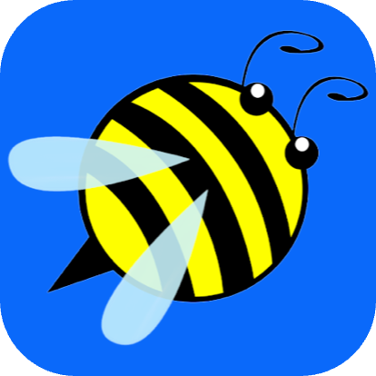

# Project Tier Table

Below are my projects ranked with **[Personal Repository Guidelines (PRG)](https://github.com/scottgriv/PRG-Personal-Repository-Guidelines)**:

| Icon&nbsp;&nbsp;&nbsp;&nbsp;&nbsp;&nbsp;&nbsp;&nbsp;&nbsp;&nbsp;&nbsp;&nbsp;&nbsp;&nbsp;&nbsp;&nbsp;&nbsp;&nbsp; | Name | Created&nbsp;&nbsp;&nbsp;&nbsp;&nbsp;&nbsp;&nbsp;&nbsp;&nbsp;&nbsp;&nbsp;&nbsp;&nbsp;&nbsp;&nbsp;&nbsp; | Description | Category | Technology | Tier&nbsp;&nbsp;&nbsp;&nbsp;&nbsp;&nbsp;&nbsp;&nbsp;&nbsp;&nbsp;&nbsp;&nbsp;&nbsp;&nbsp;&nbsp;&nbsp;&nbsp;&nbsp;&nbsp;&nbsp;&nbsp;&nbsp;&nbsp;&nbsp;&nbsp;&nbsp;&nbsp;&nbsp;&nbsp;&nbsp;&nbsp;&nbsp;&nbsp;&nbsp;&nbsp; |
| :---: | :---: | :---: | :--- | :--- | :--- | :---: |
|  | [Recipe-Resizer](https://reciperesizer.com) | 2023-01-22 | A utility application that allows you to resize recipes, convert unit of measure, cooking tips, and save your favorite recipes. | N/A | N/A |  |
|  | [Bee-Heard](https://beeheard.com) | 2023-01-01 | To be announced. | N/A | N/A |  |
|  | [River-Charts](https://github.com/scottgriv/River-Charts) | 2023-09-14 | A Python, Django, Plotly, and Pandas web application that visualizes river data pulled using an API from the United States Geological Survey (USGS). | Web, Charts | Python, Django, Plotly, Pandas, API |  |
|  | [PRG-Personal-Repository-Guidelines](https://github.com/scottgriv/PRG-Personal-Repository-Guidelines) | 2023-10-08 | A repository categorization and guideline system developed to standardize repositories, projects, README's, and overall repository structure. Utilizes GitHub Actions to create a custom table to showcase your categorized repositories utilizing a tier based structure. | Guidelines | Markdown, GitHub Actions |  |
|  | [Palm-Tree](https://github.com/scottgriv/Palm-Tree) | 2023-01-01 | A web based CRM application with Google Business Review email request capabilities. |  |  |  |
|  | [Post.e](https://github.com/scottgriv/Post.e) | 2023-01-22 | A fully functional, multi-programming language, "how-to-build" social media application. |  |  |  |
|  | [portfolio-website](https://github.com/scottgriv/portfolio-website) | 2023-01-15 | My portfolio website. |  |  |  |
|  | [scottgriv](https://github.com/scottgriv/scottgriv) | 2023-01-23 | About Me: @scottgriv. |  |  |  |

<i><b>Built with GitHub Actions</b></i> <i><b>Visit my GitHub Profile <a href="https://github.com/scottgriv" target="_blank">@scottgriv</a></b></i> <b>Last Updated: 2023-10-10 23:27:31</b>

