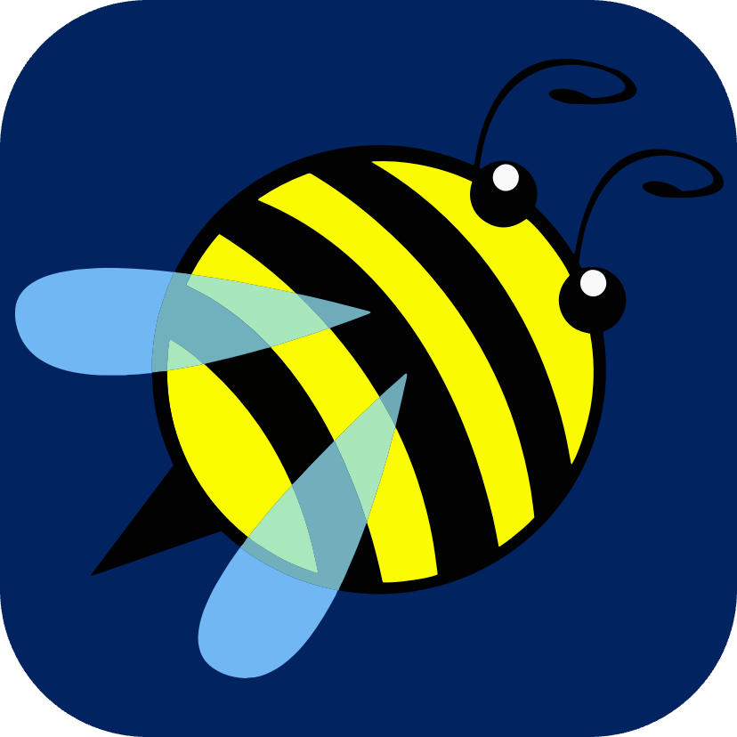

## Private Project Tier Table

| Icon                                                                                                                                                                                                                                        | Name                                                                                                      | Created&nbsp;&nbsp;&nbsp;&nbsp; | Owner           | Description                                                              | Technology&nbsp; | Category         | Tier  | Order |
|--:-:----------------------------------------------------------------------------------------------------------------------------------------------------------------------------------------------------------------------------------------|--:-:------------------------------------------------------------------------------------------------------|--:-:----------------------------|--:-:------------|--:-:---------------------------------------------------------------------|--:-:-------------|--:-:-------------|--:-:--|--:-:--|
|  | <a href="https://github.com/Night-Owl-Labs/Bee-Heard-Code-Memos" target="_blank">Bee-Heard-Code-Memos</a> | 2024-07-08                      | Night-Owl-Labs | 🐝 A VSCode Extension that allows you to record voice memos as you code. | JavaScript       | VSCode Extension | Gold  | 9     |
