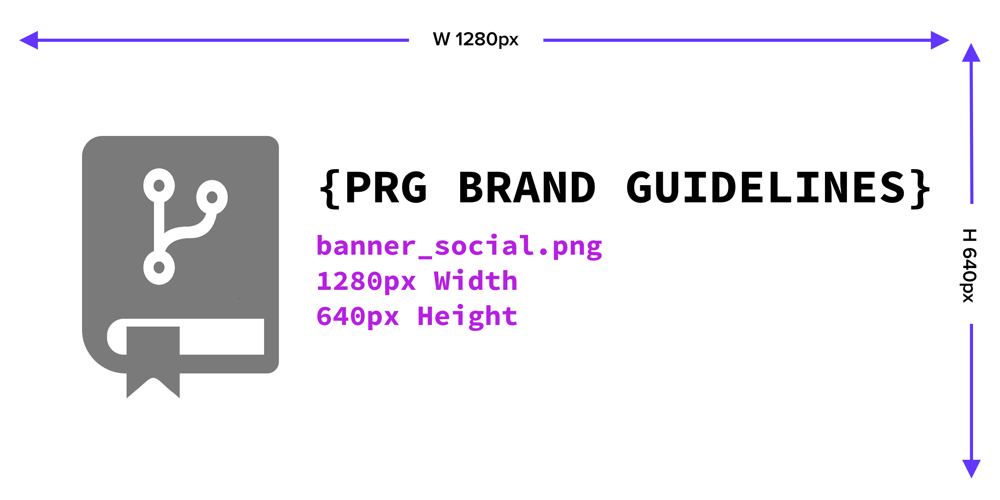
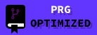
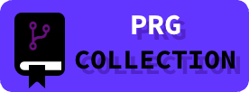

<div align="center">
    <a href="https://github.com/scottgriv/PRG-Personal-Repository-Guidelines" target="_blank">
        
    </a>
</div>

<h1 align="center">Brand Guidelines</h1>

Below is a summary of the brand guidelines for a **PRG** project:
- Consider these guidelines as a reference for your project's branding strategy.
- It is highly recommended for **Platinum** and **Gold** tier projects to adhere closely to these guidelines.
- While optional for other tiers, applying these guidelines to your projects can enhance their branding coherence.

---------------

## Table of Contents

- [Software Design](#software-design)
- [Color Palette](#color-palette)
- [Typography](#typography)
- [Dimension Reference Table](#dimension-reference-table)
- [Icon](#icon)
- [Banners](#banners)
    - [Small Banner](#small-banner)
    - [Large Banner](#large-banner)
    - [Social Banner](#social-banner)
    - [Header & Footer Icons](#header--footer-icons)
        - [Header Icon](#header-header)
        - [Footer Icon](#footer-icon)
        - [Rounded Corners](#rounded-corners)
    - [PRG Profile Badge](#prg-profile-badge)
    - [Optional Banners](#optional-banners)
        - [X Banner](#x-banner)
        - [LinkedIn Banner](#linkedin-banner)
- [Diagrams](#diagrams)
- [Medium Articles & Other Social Media](#medium-articles--other-social-media)
- [Demo & Screenshots](#demo--screenshots)
- [Images & Assets](#images--assets)
- [Closing](#closing)
- [Resources](#resources)

## Software Design

I develop all of my UI/UX designs using [Figma](https://www.figma.com/) and [Sketch](https://www.sketch.com/).
- Figma is a free web-based design tool that allows you to create designs and prototypes.
- Sketch is a paid macOS design tool that allows you to create designs and prototypes.
- The combination of using Figma for prototyping and wireframing and Sketch for designing and creating assets is a great workflow for me.
- Overall, be sure to use a Vector design tool (Figma, Sketch, Adobe XD, etc.) to create your designs.

**Design in Vectors not Pixels!**
- This will allow you to export your designs as SVGs and high quality PNGs where applicable.
- To read more about Raster (Bitmap/Pixel) images vs. Vector (math) images, see [this article](https://vector-conversions.com/vectorizing/raster_vs_vector.html).
    - It's recommended to design your images using the dimensions below in this guide (@1x), but export your images double the size of the required dimensions (@2x).
    - It's always recommended to design vectors @1x and scale up, vs. designing @3x and scaling down using rasters.
        - For example, if the dimensions are `100x100` (@1x), export the image as `200x200` (@2x) or `300x300` (@3x).
        - This will allow you to have a higher quality image when you resize it to the dimensions listed below.
        - Most design tools will allow you to export your images at a higher resolution automatically by toggling `@2x` or `@3x` in the export settings.
        - Checkout my handy little tool, [Resolution Scale Calculator](https://scottgriv.github.io/Resolution-Scale-Calculator/), to scale image dimensions up or down.

> [!IMPORTANT] 
> Be sure to document your colors, fonts, and designs in your project's `README` file and `docs` folder or a private design repository where your designs will be stored.

## Color Palette

The color palette for a **PRG** project is as follows:

| Color         | Hex                                                                |
| ------------- | ------------------------------------------------------------------ |
| White         |  `#FFFFFF` |
| Black         |  `#000000` |
| Gray          |  `#7A7A7A` |
| Purple 1      |  `#6236FF` |
| Purple 2      |  `#680F7F` |
| Platinum      |  `#E5E4E2` |
| Gold          |  `#FFD700` |
| Silver        |  `#C0C0C0` |
| Bronze        |  `#CD7F32` |

## Typography

The typography for a **PRG** project is as follows:
- Font Family: [Source Code Pro](https://fonts.google.com/specimen/Source+Code+Pro)

## Dimension Reference Table

> [!NOTE] 
> ```tex
> Following the notation: Width×Height (in pixels), using vectors (@1x).
> ```

| Design            | File Name                    | Dimensions (WxH) |
| ----------------- | ---------------------------- | ---------------- |
| Icon              | icon.png (and prg.png)       | `414x414`        |
| Small Banner      | banner_small.png             | `400x128`        |
| Large Banner      | banner_large.png             | `1280x260`       |
| Social Banner     | banner_social.png            | `1280x640`       |
| Header            | icon.png (or header.png)     | `200x200`        |
| Footer            | icon.png (or footer.png)     | `100x100`        |
| X Banner          | banner_x.png                 | `1500x500`       |
| LinkedIn Banner   | banner_linkedin.png          | `1128x191`       |
| PRG Profile Badge | prg_optimized/collection.png | `138x51`         |

> [!IMPORTANT]
> I suggest exporting the vectors @2x to double the size for display.
> View the below break down for the above table, it provides more information on each design.

## Icon

- This is "Application Icon" of your project.
    - The logo should adhere to your brand and color palette.
    - Create a logo that is unique to your project.
- This can be placed on the bottom of your `README` file and used as your footer.
    - See [Footer](./readme_guidelines.md#footer) for more information.
- For Silver/Bronze projects, this image can also go on the top of your `README` and used as your header.
    - Adjust the size as you see fit.
- The size of the `icon.png` file should be `414x414` pixels.


> [!IMPORTANT] 
> This is the file that will be used for the logo in your project's `project_tier_table.md` file.
> See [Project Tier List](../README.md#project-tier-table) for more information.

## Banners

### Small Banner

- This can be placed on your personal `README` file, or wherever you'd like to place it.
- The size of the `banner_small.png` file should be `400x128` pixels.


### Large Banner

- This can be placed on the top of your project `README` file, or wherever you'd like to place it.
- The size of the `banner_large.png` file should be `1280x260` pixels.


### Social Banner

- This can be used for social sharing of your repository link from GitHub.
- See _Settings -> Social preview_ for more information under your project's settings.
- The size of the `banner_social.png` file should be `1280x640` pixels.



- [According to GitHub](https://docs.github.com/en/repositories/managing-your-repositorys-settings-and-features/customizing-your-repository/customizing-your-repositorys-social-media-preview):
    - Images should be at least 640×320px (1280×640px for best display).
    - See [Customizing your repository's social media preview](https://docs.github.com/en/repositories/managing-your-repositorys-settings-and-features/customizing-your-repository/customizing-your-repositorys-social-media-preview) for more information.


### Header & Footer Icons

- **Gold/Platinum** projects should use the `large_banner.png` file for its header icon and `icon.png` or `icon-rounded.png` files for its footer icon.
- **Silver/Bronze** projects should use the `icon.png`/`icon-rounded.png` or `header.png`/`footer.png` files for their header and footer.
    - The footer can be the same as the icon/logo in the header.
    - Rounded corners to imitate app icons should be used for the footer and/or header.
    - You can use a different icon if needed, this is optional to save work/time.
- Place the footer at the bottom of your `README` file below a divider.
    - The size of the `header.png` file used for the footer should be `200x200` pixels.
    - The size of the `footer.png` file used for the footer should be `100x100` pixels.
    - I personally use a rounded corner variation of this icon for my header and footer on Silver/Bronze projects. See [Rounded Corners](#rounded-corners) for more information.
- The footer should also be a centered clickable image link to your personal website, GitHub profile, or main repo branch for said project.
    - This is _required_ for **ALL** project tiers.
    - Reference the [Template Guide](../templates/template_guide.md) for more information.
- The header icon should always be clickable and take you to your project's website/product/demo.
    - If you do not have a website/product/demo, you should link it to your projects repository main branch.
    - This is _required_ for **ALL** project tiers.
    - Reference the [Template Guide](../templates/template_guide.md) for more information.

#### Header Icon


#### Footer Icon


#### Rounded Corners

- I round my corners for both the `icon.png` and `banner_small.png` files.
    - Resulting in: `icon-rounded.png` and `banner_small-rounded.png`.
- I use the following website to round my corners: [Round Corners](https://round-corner.imageonline.co/)
    - For the `icon.png` file, I move the toggle bar to the far right and then move it to the left 5 times.
    - For the `banner_small.png` file, I move the toggle bar to the far left and then move it to the right 5 times (the opposite of `icon.png`).
    - You can do this rounding in your design tool as well, but I find this website to quick and easy to use.

### PRG Profile Badge

- Place this in your GitHub profile's `README` file (usually on the bottom).
- The size of the `prg.png` file should be `138x51` pixels.
- You do not need to create this image, it is already included in the `docs/images` folder (`docs/images/prg_optimized.png`, `docs/images/prg_collection.png`, or `docs/images/prg_portfolio.png`).
    - The image should be centered.
    - The hyperlink should take you to your **PRG Collection** website after building the Tier Table for the first time using the `scripts/project_tier_table_generator.py` script and can be found in the `categories/badge_reference_guide.md` file.

<a href="https://prgportfolio.com" target="_blank">
    
</a><a href="https://prgportfolio.com" target="_blank">
    
</a><a href="https://prgportfolio.com" target="_blank">
    
</a>

### Optional Banners

The following are optional, but you made need them depending on your project:

#### X Banner

- This can be used for your X profile banner.
- The size of the `banner_x.png` file should be `1500x500` pixels.
- Please read the X image specifications [here](https://snappa.com/blog/twitter-header-size) for more information.

#### LinkedIn Banner

- This can be used for your LinkedIn profile banner.
- The size of the `banner_linkedin.png` file should be `1128x191` pixels.
- Please read the LinkedIn image specifications [here](https://www.linkedin.com/help/linkedin/answer/a563309/image-specifications-for-your-linkedin-pages-and-career-pages) for more information.

## Diagrams

- Diagrams are a great way to visualize your project's architecture and design.
- Diagrams are not required for any project, but are encouraged for Platinum/Gold tier projects.
- I personally like to use UML diagrams for my project, specifically PlantUML.
    - PlantUML is a free open-source tool that allows you to create UML diagrams using a simple text-based language.
    - You can read more about PlantUML [here](https://plantuml.com/).

## Medium Articles & Other Social Media

- Again, articles or blog posts are not required for any project, but are encouraged for Platinum/Gold tier projects.
- I personally like to post my project on X and LinkedIn (under projects).
    - This is where the social banners come in handy.
- I also like to write a brief article on Medium about my project.
    - This is a great way to document your project and share it with others.
    - You can read more about Medium [here](https://medium.com/).

## Demo & Screenshots

- A demo is not required for any project, but is encouraged for Platinum/Gold tier projects.
- Name your screenshots and GIF's whatever you'd like, but be sure to place them in the `docs/images` folder.
    - I usually name my demo `demo_1.png, demo_2.png, demo_1.gif, etc.` and place it in the `docs/images/demo` folder.
    - I also usually place these on the top of my `README` file and hyperlink it to the product demo.

## Images & Assets

- Include repo images and GIFs in a `docs/images` folder.
    - I create all of my GIFs using paid tools like [GiFox](https://gifox.io/) and [Snagit](https://www.techsmith.com/screen-capture.html).
- Include repo videos in a `docs/videos` folder.
- Add important documents to the `docs` folder.
- Add more folders as needed.

> [!TIP]  
> Append `#gh-dark-mode-only` or `#gh-light-mode-only` to the end of the image URL to only show the image in dark or light mode respectively. Be sure to have both a dark and light version of the image when necessary. More on this (shameless plug) [here](https://github.com/scottgriv/markdown-demo#images).

## Closing

- Export all of your designs as SVGs and PNGs where applicable.
- If you're using Sketch, I would suggest making a page called `Designs` and naming each Art Board with the following naming convention (or frames using Figma):
    - `icon`
    - `banner_small`
    - `banner_large`
    - `banner_social`
        - This will allow your icons to be exported with the suggested naming convention.
- Include all of the above designs in your `docs/images` folder.
- As mentioned before, you do not need to include your source file (.fig, .sketch, .psd, etc.) in your repository, but you should store it in a private design repository or take a backup of it somewhere else where you can access it if needed.
- Because each design will be a different dimension and size, feel free to move your images around and font sizes to make each design flow properly. It does not have to be the same exact design simply resized to fit the dimensions.

## Resources

- [Resolution Scale Calculator](https://scottgriv.github.io/Resolution-Scale-Calculator/) - Personal project I built to scale image dimensions up or down for @1x, @2x, or @3x.
- [X Header Size](https://snappa.com/blog/twitter-header-size) - X Header Size
- [LinkedIn Banner Size](https://www.linkedin.com/help/linkedin/answer/a563309/image-specifications-for-your-linkedin-pages-and-career-pages) - LinkedIn Banner Size
- [PlantUML](https://plantuml.com/) - PlantUML, a free open-source tool that allows you to create UML diagrams using a simple text-based language.
- [Medium](https://medium.com/) - Medium, a great way to document your project and share it with others.
- [Figma](https://www.figma.com/) - Figma, a free web-based design tool that allows you to create designs and prototypes.
- [Sketch](https://www.sketch.com/) - Sketch, a paid macOS design tool that allows you to create designs and prototypes.
- [GitHub Logos and Usage](https://github.com/logos) - GitHub Logos and Usage
- [Customizing your repository's social media preview](https://docs.github.com/en/repositories/managing-your-repositorys-settings-and-features/customizing-your-repository/customizing-your-repositorys-social-media-preview) - Customizing your repository's social media preview on GitHub
- [Round Corners](https://round-corner.imageonline.co/) - Round Corners online tool
- [Raster vs. Vector](https://vector-conversions.com/vectorizing/raster_vs_vector.html) - A great article on Raster vs. Vector images
- [GiFox](https://gifox.io/) - Paid GIF recording tool for macOS.
- [Snagit](https://www.techsmith.com/screen-capture.html) - Paid screen capture tool for macOS and Windows.