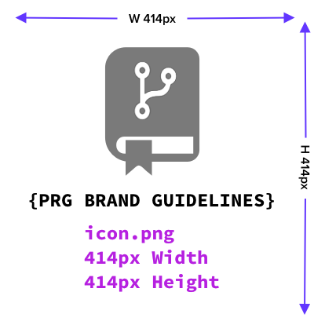
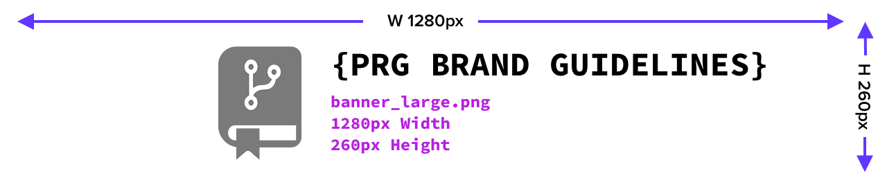

## Brand Guidelines
Below are the brand guidelines for a **PRG** project. 
- These guidelines are meant to be used as a reference for the project's branding.
- **Gold** tier projects are encouraged to follow these guidelines as closely as possible.
- You can apply these guidelines to your other tier projects if you'd like, but it's not required.

### Software Design
I develop all of my UI/UX designs using [Figma](https://www.figma.com/) and [Sketch](https://www.sketch.com/).
- Figma is a free web-based design tool that allows you to create designs and prototypes.
- Sketch is a paid macOS design tool that allows you to create designs and prototypes.
- The combination of using Figma for prototyping and wireframing and Sketch for designing and creating assets is a great workflow for me.

> [!IMPORTANT] 
> Be sure to document your colors, fonts, and designs in your project's `README.md` file and `docs` folder or a private design repository where your designs will be stored.

### Color Pallete
The color pallete for a **PRG** project is as follows:
-  `#FFFFF`
-  `#000000`
-  `#7A7A7A`
-  `#6236FF`
-  `#680F7F`

### Typography
The typography for a **PRG** project is as follows:
- Font Family: [Source Code Pro](https://fonts.google.com/specimen/Source+Code+Pro)

### Logo
- The logo should adhere to your brand and color pallete.
- Create a logo that is unique to your project.
- **PRG** logo example:


### Icon

Width×Height

> [!NOTE] 
> ```tex
> Following the notation: Width×Height
> ```

- The icon is the same as the logo, this is "Application Icon" of your project.
- This can be placed on the bottom of your `README.md` file, or wherever you'd like to place it.
    - See [Footer](./readme_guidelines.md#footer) for more information.
- The size of the `icon.png` file should be `414x414` pixels.



> [!IMPORTANT] 
> This is the file that will be used for the logo in your project's `projet_tier_table.md` file.
> See [Project Tier List](../README.md#project-tier-table) for more information.

### Banners

#### Small Banner
- This can be placed on your personal `README.md` file, or wherever you'd like to place it.
- The size of the `banner_small.png` file should be `400x128` pixels.


#### Large Banner
- This can be placed on the top of your project `README.md` file, or wherever you'd like to place it.
- The size of the `banner_large.png` file should be `1280x260` pixels.



#### Social Banner
- This can be used for social sharing of your repository link.
- See Settings -> Social preview for more information under your project's settings.
- The size of the `banner_social.png` file should be `1280px640` pixels.


#### Rounded Corners
- I round my corners for both the `icon.png` and `banner_small.png` files.
- I use the following website to round my corners: [Round Corners](https://round-corner.imageonline.co/)
    - For the `icon.png` file, I move the toggle bar to the far right and then move it to the left 5 times.
    - For the `banner_small.png` file, I move the toggle bar to the far left and then move it to the right 5 times (the opposite of `icon.png`).
    - You can do this rounding in your design tool as well, but I find this website to quick and easy to use.

### Closing
- Export all of your designs as SVGs and PNGs where applicable.
- If you're using Sketch, I would suggest making a page called `Designs` and naming each artboard with the following naming convention (or frames using Figma):
    - `icon`
    - `banner_small`
    - `banner_large`
    - `banner_social`
        - This will allow your icons to be exported with the suggested naming convention.
- Include all of the above designs in your `docs/images` folder.
- As mentioned before, you do not need to include your source file (.fig, .sketch, .psd, etc.) in your repository, but you should store it in a private design repository or take a backup of it somewhere else where you can access it if needed.
- Because each design will be a different dimension and size, feel free to move your images around and font sizes to make each design flow properly. It does not have to be the same exact design simply resized to fit the dimensions.
