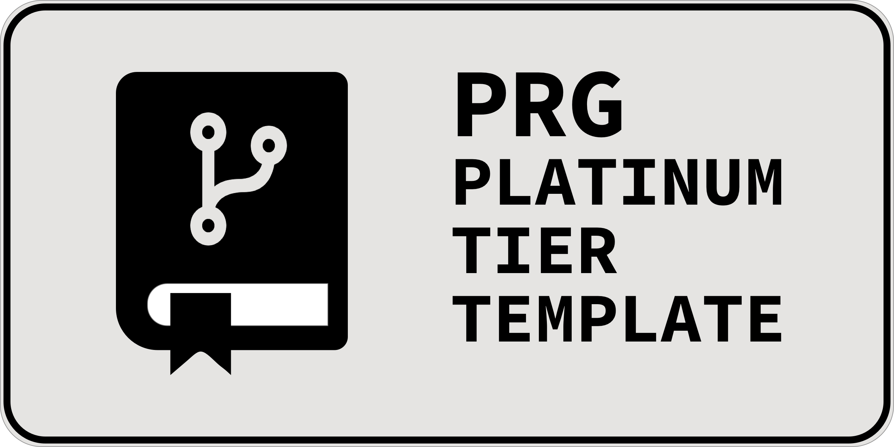
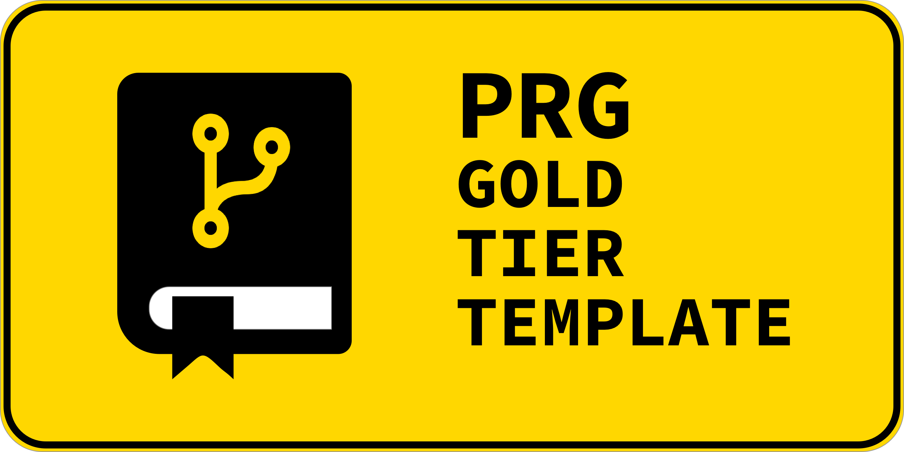
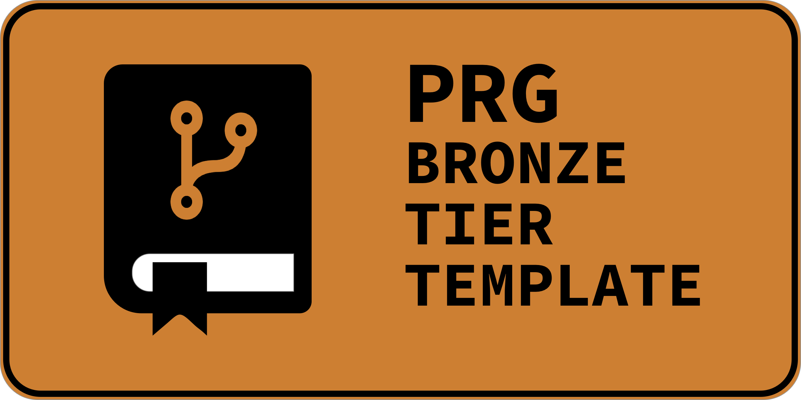

    

<h1 align="center">Template Guide</h1>

This document serves as a comprehensive guide for accessing and utilizing the tier-specific templates within **PRG**. 
- Each categorized tier –  **Platinum**,  **Gold**,  **Silver**, and  **Bronze** – has its own customized repository and `README` templates that cater to different levels of project complexity and requirements.
- Consult the [Category Guidelines](../guidelines/category_guidelines.md) for more information on the different project categories and their respective tiers.

---------------

## Table of Contents
- [Platinum Tier Template](#platinum-tier-template)
- [Gold Tier Template](#gold-tier-template)
- [Silver Tier Template](#silver-tier-template)
- [Bronze Tier Template](#bronze-tier-template)
- [Using the Templates](#using-the-templates)
- [Resources](#resources)

##  Platinum Tier Template

 

[ PRG Platinum Tier Public Template Repository](https://github.com/scottgriv/PRG-Platinum-Tier-Template)

 Designed for the most ambitious and sophisticated projects, this template transcends the ordinary, offering a comprehensive framework for thorough documentation, advanced feature integration, and high-level project presentation.

##  Gold Tier Template

 

[ PRG Gold Tier Public Template Repository](https://github.com/scottgriv/PRG-Gold-Tier-Template)

Tailored for advanced and comprehensive projects, this template includes extensive sections and badges suitable for a robust and detailed presentation. 

##  Silver Tier Template

 

[ PRG Silver Tier Public Template Repository](https://github.com/scottgriv/PRG-Silver-Tier-Template)

Designed for intermediate-level projects, this template balances detail and simplicity, providing a streamlined yet informative layout. 

##  Bronze Tier Template

 

[ PRG Bronze Tier Public Template Repository](https://github.com/scottgriv/PRG-Bronze-Tier-Template)

Ideal for basic or beginner-level projects, this template focuses on simplicity and ease of use, ensuring a clear and concise project overview. 

## Using the Templates

To use the above templates, you can do one of two things:

1. Access the template you want to use by clicking on the appropriate link above, then click the green **Use this template** button in the top right corner of the repository page.
    - This will create a new repository with the template's contents, which you can then clone to your local machine and edit as needed.
    - Follow the instructions on GitHub Docs: [Creating a repository from a template](https://docs.github.com/en/repositories/creating-and-managing-repositories/creating-a-repository-from-a-template) for more information.
    
2. Click on the appropriate template link above, then **Fork** the template repository.
    - When you click **New Repository**, you will now have an option under **Repository template** to select the template you just forked. 
    - This will create a new repository with the template's contents, which you can then clone to your local machine and edit as needed.
    - View the [README Guidelines](../guidelines/readme_guidelines.md) for more information on how to edit the template's contents.

## Resources

- [Creating a repository from a template](https://docs.github.com/en/repositories/creating-and-managing-repositories/creating-a-repository-from-a-template) - GitHub Docs on creating a repository from a template.
- [Creating a template repository](https://docs.github.com/en/repositories/creating-and-managing-repositories/creating-a-template-repository#creating-a-template-repository) - GitHub Docs on creating a template repository.
- [Managing project templates in your organization](https://docs.github.com/en/issues/planning-and-tracking-with-projects/managing-your-project/managing-project-templates-in-your-organization) - GitHub Docs on managing project templates in your organization.

